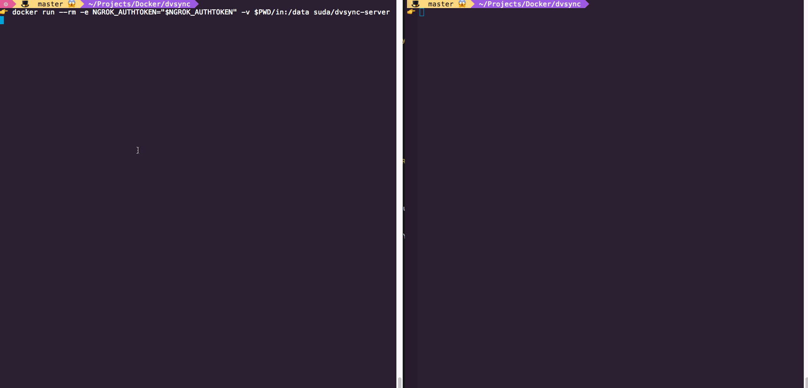

<h1 align="center">
	<br>
	
	<br>
	<br>
	<br>
</h1>

> Easy and secure way to copy data between Docker volumes, even across VPCs or data centers.

`dvsync` is a set of two containers running [OpenSSH](https://www.openssh.com/), [ngrok](https://ngrok.com/) and [rsync](https://rsync.samba.org/) that automatically create a secure, encrypted channel between each other and enable easy way to migrate data stored in Docker volumes.

**Client:** [](https://quay.io/repository/suda/dvsync-client) **Server:** [](https://quay.io/repository/suda/dvsync-server)

<hr />



# Running

⚠️ **To establish a secure channel, `dvsync` uses [ngrok](https://ngrok.com/) and you need to pass your `NGROK_AUTHTOKEN` which can be found in [ngrok dashboard](https://dashboard.ngrok.com/auth).**

`dvsync` will synchronize contents of its `/data` directory, therefore whatever data you want to sync, should be mounted under it.

Here are example ways to run it using [Docker CLI](#docker-cli), [Docker Compose / Swarm](#docker-compose--swarm) or [Kubernetes](#kubernetes). Note that you can mix those, making data migration much easier.

## Docker CLI

1. Start a server where you want to copy data **from**:
```sh
docker run --rm -e NGROK_AUTHTOKEN="$NGROK_AUTHTOKEN" \
  --mount source=MY_SOURCE_VOLUME,target=/data,readonly \
  quay.io/suda/dvsync-server
```

2. Once the server started, look into the logs and copy the `DVSYNC_TOKEN`
3. Start the client where you want tot copy the data **to**:
```sh
docker run --rm -e DVSYNC_TOKEN="$DVSYNC_TOKEN" \
  --mount source=MY_TARGET_VOLUME,target=/data \
  quay.io/suda/dvsync-client
```

#### Using local source/target
Alternatively, if you want to copy this data to your local machine, you can mount a host directory as well:

```sh
docker run --rm -e DVSYNC_TOKEN="$DVSYNC_TOKEN" \
  -v $PWD:/data \
  quay.io/suda/dvsync-client
```
This can also be done other way around, when you start the server locally if you need to copy local data into the data center.

## Docker Compose / Swarm

1. Start a server where you want to copy data **from**:
```yaml
version: '3.6'
services:
  dvsync-server:
    image: 'quay.io/suda/dvsync-server'
    environment:
      NGROK_AUTHTOKEN: ${NGROK_AUTHTOKEN}
    volumes:
      - type: volume
        source: MY_SOURCE_VOLUME
        target: /data
        read_only: true
volumes:
  MY_SOURCE_VOLUME:
```

2. Once the server started, look into the logs and copy the `DVSYNC_TOKEN`
3. Start the client where you want tot copy the data **to**:
```yaml
version: '3.6'
services:
  dvsync-server:
    image: 'quay.io/suda/dvsync-client'
    environment:
      DVSYNC_TOKEN: ${DVSYNC_TOKEN}
    volumes:
      - type: volume
        source: MY_TARGET_VOLUME
        target: /data
volumes:
  MY_SOURCE_VOLUME:
```

## Kubernetes

1. Start a server where you want to copy data **from**:
```yaml
apiVersion: v1
kind: Pod
metadata:
  name: dvsync-server
spec:
  containers:
  - image: quay.io/suda/dvsync-server
    name: dvsync-server
    env:
    - name: NGROK_AUTHTOKEN
      value: "REPLACE WITH YOUR NGROK_AUTHTOKEN"
    volumeMounts:
    - mountPath: /data
      name: MY_SOURCE_VOLUME
  volumes:
  - name: MY_SOURCE_VOLUME
```
2. Once the server started, look into the logs and copy the `DVSYNC_TOKEN`
3. Start the client where you want tot copy the data **to**:
```yaml
apiVersion: v1
kind: Pod
metadata:
  name: dvsync-client
spec:
  containers:
  - image: quay.io/suda/dvsync-client
    name: dvsync-client
    env:
    - name: DVSYNC_TOKEN
      value: "REPLACE WITH YOUR DVSYNC_TOKEN"
    volumeMounts:
    - mountPath: /data
      name: MY_TARGET_VOLUME
  volumes:
  - name: MY_TARGET_VOLUME
```

# Contributing

[All contributions (no matter if small) are always welcome](http://contributionswelcome.org/).

To see how you can help and where to start [see Contributing file](CONTRIBUTING.md).
